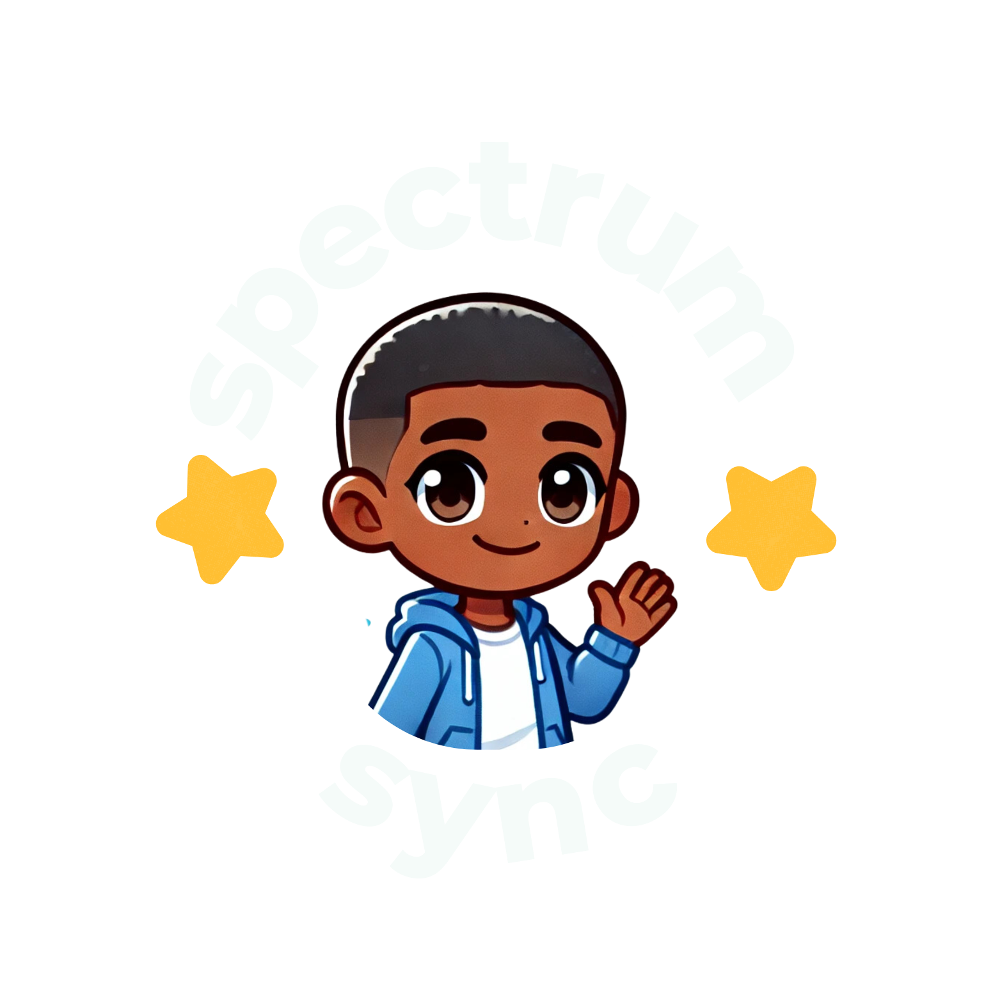
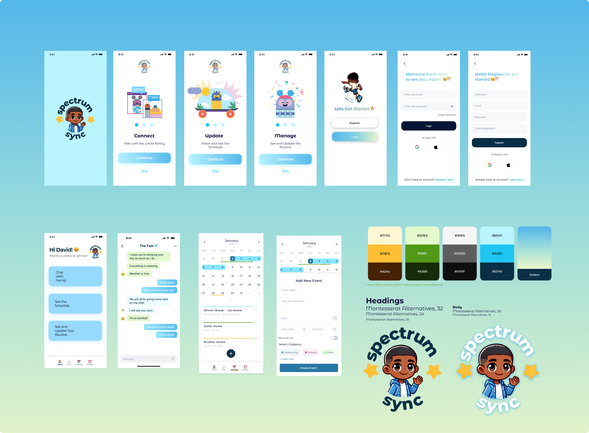
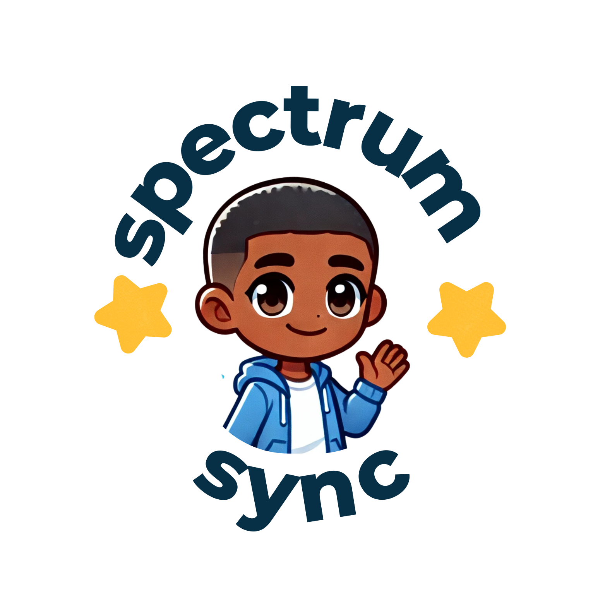

# Spectrum Sync 🌟




## About Spectrum Sync 🧩


**Spectrum Sync** is a mobile app designed to support individuals on the autism spectrum by streamlining communication and organization for families and caregivers. Stay connected, manage schedules, and enhance collaboration effortlessly. 💙

---

## Features 🚀

### Welcome to Spectrum Sync 🎉


- **Connect** 🤝: Stay in touch with the entire family effortlessly.
- **Update** 🔄: Share updates and stay informed with schedule adjustments.
- **Manage** 📅: Organize routines and tasks with an easy-to-use interface.

---

### Group Messaging 💬


- 📡 Real-time messaging with family members.
- 🔔 Share updates, reminders, and thoughts to keep everyone on the same page.
- ✅ Designed for clarity and ease of use.

---

### Calendar and Scheduling 🗓️

- ➕ Add and customize events for specific days.
- 👀 Visualize routines and schedules in a family-friendly layout.
- 🧭 Streamlined navigation for easy date selection.

---

### Onboarding and Authentication 🔐

- 🆕 Easy account creation with options for Google, Apple, or Email.
- 🔒 Secure login for each family member.
- 🛠️ Friendly onboarding process to guide users through features.

---

### Design Highlights 🎨


- 🎨 **Colors**: Thoughtfully chosen palette for a calming experience.
- ✍️ **Typography**: Montserrat fonts for readability and accessibility.
- 🖼️ **Icons and Graphics**: Custom illustrations that add a personal touch.

---

## Tech Stack 🛠️

- **Frontend**: Swift for iOS development.
- **Backend**: Azure Web App and Azure MSSQL databases.
- **Design Tools**: Figma for UI/UX design.

---

## Installation ⚙️

1. Clone the repository:
   ```bash
   git clone https://github.com/hamidatb/SpectrumSync.git
   ```

2. Navigate to the project directory:
   ```bash
   cd SpectrumSync
   ```

3. Install dependencies:
   ```bash
   pod install
   ```

4. Open the project in Xcode and build:
   ```bash
   open SpectrumSync.xcworkspace
   ```

5. Run the application on a simulator or connected iOS device. 📱

---

## Contribution Guidelines 🤝

I welcome contributions! Please read the CONTRIBUTING.md file for guidelines on submitting issues and pull requests.

---

## License 📄

Spectrum Sync is released under the [MIT License](./LICENSE). Feel free to use, modify, and distribute this project as per the license terms.

---

## Acknowledgments 🙏

- 🌟 Special thanks to the families and caregivers who inspired the creation of Spectrum Sync.
- 🎉 Gratitude to our design and development team for their dedication to accessibility and usability.

---

## Contact 📩

Have questions or feedback? Reach out at [hami.develops@gmail.com](mailto:hami.develops@gmail.com) or open an issue on GitHub.


